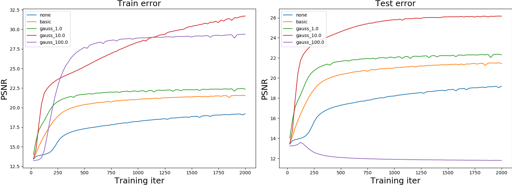

# Fourier Feature Networks | Pytorch

This is a simple PyTorch implementation of Fourier Feature Networks ([this paper](https://arxiv.org/abs/2006.10739)), translated from the officially released [code](https://github.com/tancik/fourier-feature-networks/blob/master/Demo.ipynb).

This code takes image coordinate (x,y)​ as input, and regresses/outputs the corresponding RGB pixel values.

#### The following 5 methods are compared:

- **none**:   Standard linear regression network (no mapping of input coordinate (x,y)​).
- **basic**:  Basic Fourier feature mappings of (x,y​).
- **gauss_1**: Gaussian Fourier feature mappings of (x,y)​ with scale=1.
- **gauss_10**: Gaussian Fourier feature mappings of (x,y)​ with scale=10.
- **gauss_100**: Gaussian Fourier feature mappings of (x,y)​ with scale=100.

#### Visualization of results

| Original image                                               | none                                                         | basic                                                        |
| ------------------------------------------------------------ | ------------------------------------------------------------ | ------------------------------------------------------------ |
|             |  |  |
| **gauss_1**                                                  | **gauss_10**                                                 | **gauss_100**                                                |
|  |  |  |

#### Learning curves

